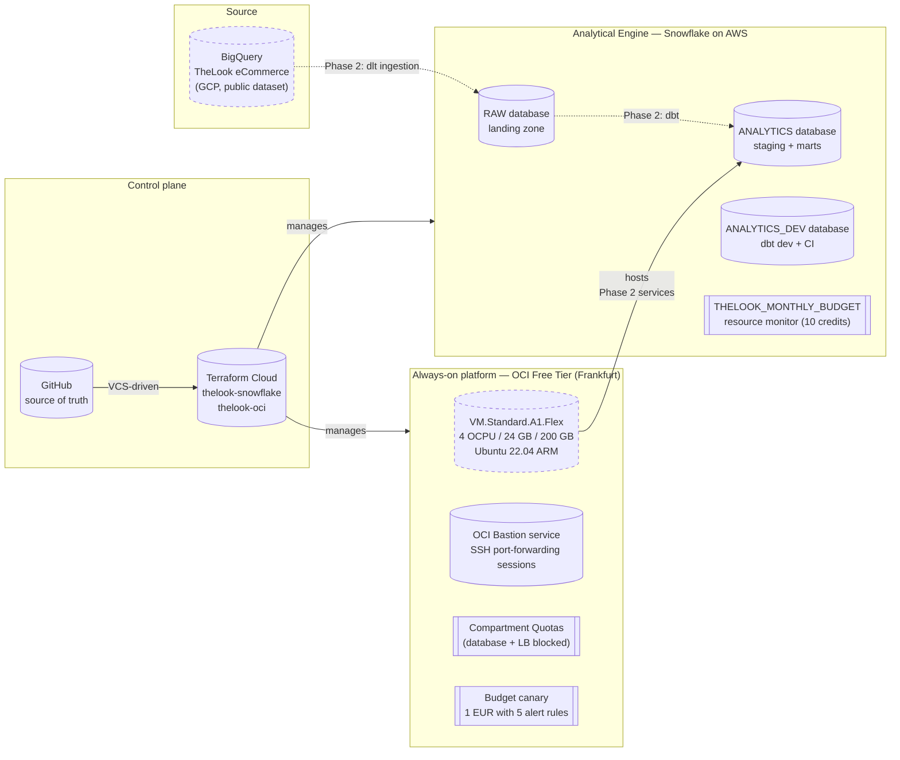
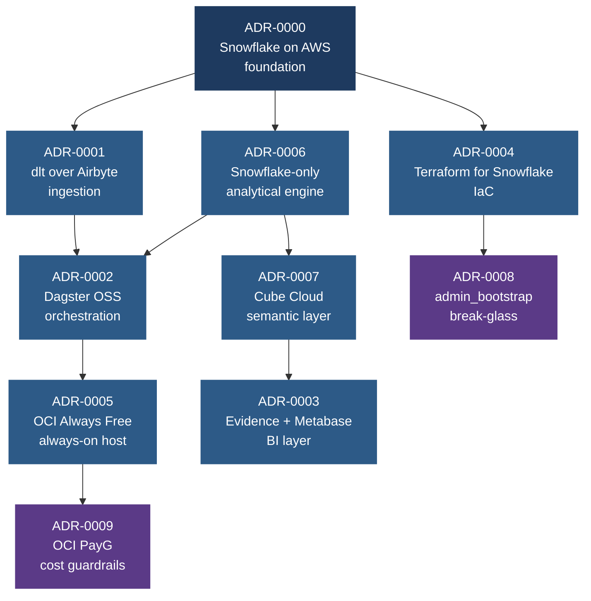
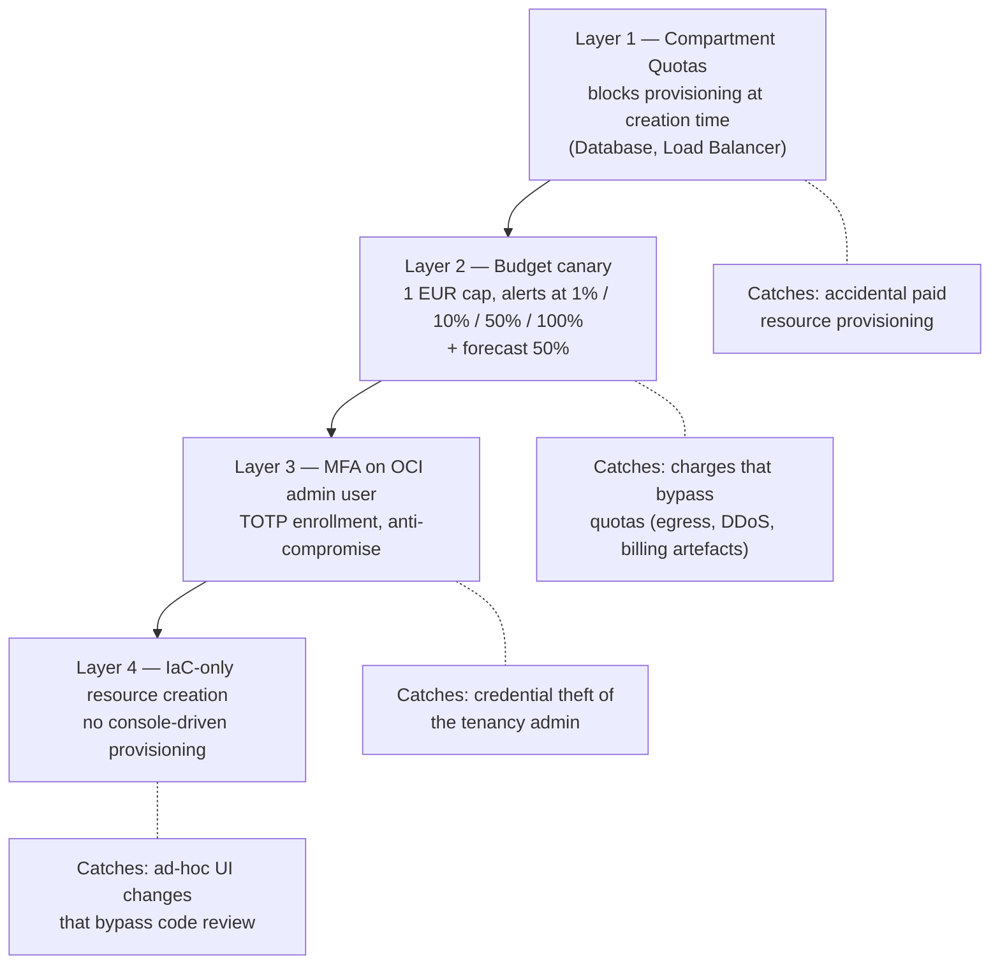

# Infrastructure and Governance Phase Closure Report

| Field | Value |
|---|---|
| **Project** | `thelook-mds` — modern data stack on a €0 TCO budget |
| **Phase** | Phase 1: Infrastructure and Governance |
| **Status** | Closed |
| **Period covered** | 2026-04-18 to 2026-04-28 |
| **Prepared by** | Gaël Mukunde |
| **Document version** | 1.0 |

## Executive Summary

This report closes the infrastructure and governance phase of the `thelook-mds` project. The phase produced a fully reproducible, code-managed analytical platform spanning two cloud providers (Snowflake on AWS, OCI Always Free), wired together by a single Terraform Cloud control plane and ten Architecture Decision Records that govern every choice in the stack. The platform operates at zero recurring cost and is ready to receive the data engineering work that follows in Phase 2 (ingestion, transformation, semantic layer, BI).

Three quantifiable outcomes anchor this phase: (1) every piece of infrastructure is declared in Terraform and rebuilds in under five minutes from `git clone`; (2) the principal-of-least-privilege boundary between automation and human operators is enforced on both providers, with break-glass paths explicitly documented; (3) a four-layer cost defense on OCI Pay-As-You-Go and a Snowflake resource monitor capped at 10 credits/month make the €0 TCO commitment auditable rather than aspirational.

The phase also surfaced two non-trivial blockers that required architectural decisions rather than purely technical fixes: an OCI Free Trial region cap that forced a credit-card-backed PayG upgrade (offset by a defense-in-depth design documented in ADR-0009), and a multi-step Snowflake credential rotation pattern necessary to retire the bootstrap ACCOUNTADMIN identity from the day-to-day automation path (ADR-0008). Both decisions and their compensating controls are documented and reviewable.

The platform is ready for Phase 2. A short next-steps section at the end of this document lists the pre-requisites that are now in place and the small set of follow-up items deferred to later iterations.

## Project Context and Constraints

### What this project is

`thelook-mds` is a personal data engineering project, designed to demonstrate hands-on competence with a modern data stack representative of a French data team's tooling in 2026, while operating under a strict zero-cost-of-ownership constraint. The project ingests the public TheLook eCommerce dataset (hosted on GCP BigQuery), transforms it with dbt on Snowflake, exposes metrics through a semantic layer (Cube Cloud), and serves dashboards through a combination of Evidence.dev (static) and Metabase (interactive).

The project is single-operator, has no end users beyond its author, no production SLA, and no regulated data. These properties are stated explicitly because they shape what good practices apply and which ones would be over-engineered for the context.

### Hard constraints

| Constraint | Origin | Consequence |
|---|---|---|
| €0 recurring cost | Project mission statement | Every component must have a free tier or a generous trial; cost-control mechanisms are required wherever real billing is theoretically possible |
| Single operator | Project context | Operational complexity must stay sustainable for one person; multi-engineer-only patterns (e.g. dedicated SRE rotations) are out of scope |
| French market alignment | Career objective | Tooling choices must reflect what French analytics engineering and data engineering teams actually use in 2026 (ADR-0000) |
| Reproducibility | Engineering discipline | Every piece of infrastructure must rebuild from `git clone` + `terraform apply` in minutes, with no manual configuration |
| Realistic ingestion | Learning objective | The data warehouse must live on a cloud separate from the source dataset, forcing a real cross-cloud ingestion pipeline (ADR-0000) |

### Soft preferences

- Python-first wherever possible (consistency across ingestion, orchestration, notebooks).
- Declarative over imperative configuration.
- Documentation-as-code: every non-trivial decision is recorded as an ADR before code is written.

## Scope Delivered

### High-level architecture

### Concrete deliverables

The phase produced the following components, all reviewable in version control under `infra/terraform/`.

**Snowflake module (`infra/terraform/snowflake/`)** declares three databases (RAW, ANALYTICS, ANALYTICS_DEV), six schemas, three warehouses sized per workload (ingestion, transform, consumer), five RBAC roles (ingestion, transform, three analyst personas), four service users with RSA key-pair authentication (dlt, dbt, Dagster, Cube), one Terraform-dedicated user with a custom role inheriting SYSADMIN + USERADMIN + SECURITYADMIN, and one resource monitor capped at 10 credits/month. Ownership of every module-managed object has been transferred from the bootstrap ACCOUNTADMIN identity to the Terraform-dedicated role.

**OCI module (`infra/terraform/oci/`)** declares one VCN with a single public subnet, an Internet Gateway, a route table, a security list, a network security group, one VM.Standard.A1.Flex instance (4 OCPU / 24 GB / 200 GB) running Ubuntu 22.04 ARM, one OCI Bastion managed service, one Reserved Public IP, one tenancy-level Compartment Quota policy (blocking paid Database and Load Balancer services), one Budget capped at 1 EUR/month, and five Budget Alert Rules at 1%, 10%, 50%, 100% (actual) and 50% (forecast) thresholds. Tenancy-level resources (quota, budget, alerts) are routed through a dedicated `oci.home` provider alias that pins them to the home region as required by OCI.

**Terraform Cloud setup** consists of two workspaces (`thelook-snowflake` and `thelook-oci`), both VCS-driven from GitHub, with sensitive variables for credentials (RSA private keys for Snowflake, OCI API key, GCP service account JSON in preparation for Phase 2). Remote state is stored on Terraform Cloud Free Tier with state locking. Pre-commit hooks (`terraform fmt`, `tflint`, `terraform validate`, `end-of-file-fixer`) run locally before every push.

**Documentation** consists of ten Architecture Decision Records (ADR-0000 through ADR-0009) covering every structural choice in the project, plus this report.

### Reproducibility check

The platform satisfies the reproducibility constraint as follows: from a bare git clone, the only manual steps are (i) provisioning fresh Snowflake and OCI tenancies, (ii) configuring Terraform Cloud workspace variables (credentials, region, email recipients), and (iii) running `terraform apply` on each workspace. Total wall-clock time, excluding human input on the credential setup, is approximately five minutes for the Snowflake workspace and ten minutes for the OCI workspace including cloud-init.

## Key Architectural Decisions

The phase is governed by ten Architecture Decision Records. The diagram below shows their dependency structure: ADR-0000 grounds the project, ADR-0001 through ADR-0007 document the tooling choices it cascades into, and ADR-0008 and ADR-0009 capture operational decisions that emerged during deployment.

A condensed summary of each ADR follows. Refer to `docs/ADR/` for the full text.

<strong>ADR-0000 — Snowflake on AWS as the data warehouse</strong>

Foundation decision. Snowflake on AWS is chosen over BigQuery on GCP, Databricks Lakehouse on AWS, and Amazon Redshift, on five drivers: French market alignment (Malt Tech Trends 2026 and 2025 reports, observed LinkedIn/Indeed postings), modern analytical architecture, cloud-agnosticism, realistic source-destination separation as an explicit learning objective (TheLook on GCP forces a cross-cloud ingestion path), and €0 TCO compatibility via the 30-day Snowflake trial.

<strong>ADR-0001 — dlt over Airbyte for ingestion tooling</strong>

dlt is chosen over Airbyte OSS, Fivetran, and custom Python scripts. Drivers: Python-first stack consistency, no infrastructure overhead (Airbyte requires Postgres + Temporal + workers), built-in incremental load primitives, native secrets handling, code-first ergonomics that fit a dbt + Dagster ecosystem.

<strong>ADR-0002 — Dagster OSS over Airflow for orchestration</strong>

Dagster OSS is chosen over Airflow, Prefect, and GitHub Actions schedules. Drivers: asset-oriented model maps dbt one-to-one through `dagster-dbt`, native asset checks support the test strategy (cross-system coherence Cube ↔ dbt ↔ Evidence), modern UI consolidates lineage and run history.

<strong>ADR-0003 — Evidence.dev + Metabase over Power BI / Tableau for the BI layer</strong>

A two-tool BI surface is chosen: Evidence.dev for static, code-defined dashboards published from CI; Metabase for interactive ad-hoc exploration. Power BI and Tableau are excluded by licensing and complexity. Apache Superset is excluded by self-hosting weight.

<strong>ADR-0004 — Terraform over SQL scripts and Snowsight UI for Snowflake IaC</strong>

Terraform with the official `snowflakedb/snowflake` provider is chosen over versioned SQL scripts, Pulumi, and custom Python. Drivers: declarative model, idempotency, state-aware destroy/recreate cycles consistent with the demo-on-demand workflow, alignment with the OCI module under the same toolchain, free remote state on Terraform Cloud.

<strong>ADR-0005 — OCI Free Tier as the always-on platform compute</strong>

OCI Always Free is chosen over Hetzner Cloud (paid), Fly.io (insufficient resources), Render.com (sleeps after inactivity), Railway (no free tier), and Dagster+ Cloud (trial expires). Drivers: 4 OCPU + 24 GB ARM capacity, 200 GB block storage, permanent free tier, sufficient for Dagster + auxiliary services in a Docker Compose stack.

<strong>ADR-0006 — Snowflake as the single analytic engine</strong>

Single-engine commitment. DuckDB as a local dev target, Oracle ADB as a fallback mirror, and Postgres on the OCI VM are all rejected as analytical engines despite their zero monetary cost, because the non-monetary cost (cross-adapter SQL correctness, CI matrix multiplication, dev/prod parity risk) outweighs the benefit at this stage.

<strong>ADR-0007 — Cube Cloud (Free / dev instance) as the semantic layer</strong>

Cube Cloud Free is chosen over self-hosted Cube Core, dbt Semantic Layer (paid Team tier required), MetricFlow standalone, LookML (paid), and "no semantic layer at all". Drivers: managed SaaS at zero cost, single-definition multi-consumer (SQL for Metabase + Evidence, REST/GraphQL for the notebook), native Snowflake connector.

<strong>ADR-0008 — `admin_bootstrap` retained as break-glass with compensating controls</strong>

After the rotation of the bootstrap ACCOUNTADMIN identity to a dedicated `USER_TERRAFORM` service user with a custom role, the question of whether to disable `admin_bootstrap` arose. Option A (disable) requires Option B (dedicated `USER_BREAK_GLASS`) as groundwork, which adds credential-management overhead with marginal benefit at this scale. Option C is chosen: retain `admin_bootstrap` with MFA, strong password, no programmatic use, and a documented scope of legitimate break-glass operations.

<strong>ADR-0009 — OCI Pay-As-You-Go with €0 cost guardrails</strong>

The OCI Free Trial cap of one subscribed region forced an upgrade to Pay-As-You-Go to access `eu-frankfurt-1` (the Paris region was systemically out of A1 capacity). The PayG upgrade is paired with a four-layer defense: Compartment Quotas as hard cap (Layer 1), Budget canary at 0.01 EUR as early detection (Layer 2), MFA on the OCI admin user as anti-compromise (Layer 3), and IaC-only resource creation as audit trail (Layer 4). The €0 TCO claim is preserved as long as the four layers hold.

## Constraints Encountered and Resolutions

### Snowflake side

**Resource monitors require ownership, not a dedicated privilege.** Snowflake's `MODIFY ON ACCOUNT` privilege does not exist, and resource monitor management is restricted to ACCOUNTADMIN unless ownership of the specific monitor is transferred. The phase resolved this by transferring ownership of `THELOOK_MONTHLY_BUDGET` to `ROLE_TERRAFORM` during the rotation, with the trade-off documented in `terraform_rbac.tf`: creating a *new* resource monitor still requires temporarily switching to ACCOUNTADMIN (a legitimate break-glass scenario per ADR-0008).

**Terraform Cloud cannot be ACCOUNTADMIN long-term.** The initial bootstrap had Terraform Cloud authenticating as `admin_bootstrap` (an ACCOUNTADMIN-scoped human user), an anti-pattern for steady-state automation. The rotation pattern documented in `terraform_rbac.tf` and ADR-0008 produces a clean separation: a custom role `ROLE_TERRAFORM` inheriting SYSADMIN + USERADMIN + SECURITYADMIN, a dedicated service user `USER_TERRAFORM` with key-pair authentication, and ownership transfer of every module-managed object. The post-rotation `terraform plan` returned `0 to add, 0 to change, 0 to destroy`, confirming the rotation is clean and idempotent.

**Trial expiry has a 30-day horizon.** Unlike BigQuery's perpetual sandbox, the Snowflake trial expires. The decision is anticipated rather than improvised: the resource monitor at 10 credits/month is the hard ceiling, and the upgrade-to-paid-plan path mirrors the defense-in-depth philosophy applied to OCI in ADR-0009.

### OCI side

**A1 capacity in `eu-paris-1` (the home region) was systemically saturated.** Multiple `terraform apply` attempts failed with `500-InternalError, Out of host capacity` on the `VM.Standard.A1.Flex` shape, including after reducing from 4 OCPU / 24 GB to 2 OCPU / 12 GB. This was not a shape-specific issue but a regional capacity contention.

**OCI Free Trial caps tenancies at one subscribed region.** The natural mitigation, deploying in `eu-frankfurt-1`, was blocked by Oracle's 2024-tightened Free Trial policy. The "Subscribe" button on Frankfurt was disabled. ADR-0009 documents the decision to upgrade the tenancy to Pay-As-You-Go, with a four-layer cost defense applied *before* the credit card was attached.

**Tenancy-level operations (quotas, budgets, IAM) only run from the home region.** OCI rejects these operations with `403-NotAllowed` if attempted from any non-home region. The Terraform module solves this with an aliased provider `oci.home` pinned to `var.home_region` (default `eu-paris-1`). Compute, networking, and storage continue to use the default provider parameterized by `var.region` (now `eu-frankfurt-1`).

**The Compartment Quota Policy DSL is finicky.** `AND` is unsupported in `WHERE` clauses (one condition per statement), and many "obvious" quota names do not exist (they must be discovered against the live tenancy via `oci limits quota list-quota`). The phase delivers a conservative quota policy (Database and Load Balancer fully blocked) with extension points documented as TODOs in `quotas.tf`.

### Terraform Cloud side

**Provider download from GitHub Releases CDN is occasionally unstable.** One run failed with `Error while installing oracle/oci v6.37.0: connection reset by peer`. This is a transient external infrastructure issue, not a code defect. Resolution is a simple retry; documented as an operational know-how rather than a code change.

## Good Practices Implemented

This section maps the practices implemented across the phase to widely-recognised software and platform engineering principles. No formal compliance norm (ISO 27001, SOC 2, NIST CSF) is claimed; the project is single-operator and not regulated. The practices are nonetheless implemented because they are the correct posture even at this scale, and they would survive scrutiny in a regulated context with minimal extension.

### Principle of least privilege

- **Snowflake.** Five custom roles (`ROLE_INGESTION`, `ROLE_TRANSFORM`, three analyst personas) each receive only the warehouse/database/schema/grant set their workload requires. Service users (`USER_DLT`, `USER_DBT`, `USER_DAGSTER`, `USER_CUBE`) are pinned to one role each. The Terraform-dedicated role (`ROLE_TERRAFORM`) inherits SYSADMIN + USERADMIN + SECURITYADMIN but is *not* ACCOUNTADMIN.
- **OCI.** The Terraform-dedicated OCI user has an API key scoped to the tenancy, not a console password. The Compartment Quotas and IAM policies prevent the creation of any resource type outside the Always Free service-side limits.

### Credential rotation and separation of concerns

- The bootstrap `admin_bootstrap` (human, ACCOUNTADMIN, password-authenticated) was retired from the day-to-day automation path within the phase. `USER_TERRAFORM` (service, key-pair-authenticated, scoped to `ROLE_TERRAFORM`) is now the canonical Terraform principal. The transition is reversible, documented in ADR-0008, and the post-transition state was verified by a clean `0 to add, 0 to change, 0 to destroy` plan.
- All Terraform Cloud sensitive variables were rotated as part of the transition (Snowflake user, role, private key).

### Defense in depth (cost control on OCI Pay-As-You-Go)

Four independent layers, each preventing a different failure mode (ADR-0009):

A similar two-layer defense applies on the Snowflake side: the resource monitor `THELOOK_MONTHLY_BUDGET` (hard cap at 10 credits/month) and the Snowflake account-level usage notifications (soft cap, configured at the account level outside Terraform).

### Multi-factor authentication on interactive admin identities

MFA was enrolled on both interactive admin identities before any production-equivalent activity: `admin_bootstrap` on the Snowflake side and the OCI human admin user on the OCI side. Service accounts authenticate via cryptographic key signature and do not require MFA.

### Infrastructure-as-Code as the single source of truth

Every chargeable or grant-bearing resource is declared in Terraform under `infra/terraform/`. The console is used only for read-only inspection and for operational tasks that have no IaC equivalent (interactive Bastion session creation, MFA enrollment, account-level billing actions). This means every cost-bearing or RBAC-bearing change must pass through a Git commit, a PR review (even single-operator review against the documented patterns), and a Terraform Cloud apply. There is no path to spin up a paid resource or grant a permission by accident from the UI.

### Audit trail

Three independent log surfaces capture every change:

- **Git history**: every code change is in `git log`, attributable, and reverts cleanly.
- **Terraform Cloud run history**: every apply is recorded with timestamp, plan output, and the user (or VCS commit) that triggered it.
- **Snowflake `ACCOUNT_USAGE.QUERY_HISTORY` and OCI Audit logs**: every effective action against the resources is logged at the provider level for at least 365 days (Snowflake) or 90 days (OCI).

The combination means that any "what changed and why" question is answerable from existing data, without additional tooling.

### Secrets management

Secrets follow a single rule: never in the repo, never in cloud-init, never in plain text on disk except as TFC sensitive variables. Snowflake private keys (PKCS#8 PEM), the OCI API private key, the GCP service account JSON (for Phase 2 ingestion), and the Snowflake account URL are all stored as Terraform Cloud sensitive variables, encrypted at rest by HashiCorp, and surfaced only at apply time. Local development uses environment variables (`TF_VAR_*`) populated from a password manager, never committed.

### Documentation as code

Every structural decision is captured in an Architecture Decision Record before the corresponding code is written. The ten ADRs (`docs/ADR/0000` to `docs/ADR/0009`) are versioned alongside the code, follow a consistent template, and explicitly document the alternatives considered and the rationale for the chosen option. ADRs make it possible to onboard a hypothetical second engineer (or a recruiter inspecting the project) without an oral handover.

### Reproducibility and demo-on-demand discipline

The "demo-on-demand warehouse" policy (introduced in ADR-0004) treats the analytical platform as ephemeral by default: provisioned at the start of an active period, destroyed at the end. This forces every piece of state to live in Git or in a cloud account that survives destroys (the Terraform Cloud workspace state is the connecting layer). The discipline is what makes the €0 TCO claim survive contact with reality: the cost meter literally stops when nothing is provisioned.

## Lessons Learned

The phase produced four classes of lessons worth recording for future phases or for a hypothetical second iteration of the project.

### Cloud-init silently overwrites OS defaults

Two specific cloud-init pitfalls cost a multi-hour debugging session on the OCI VM bring-up. Both are documented in detail in ADR-0009 § "Lessons Learned (Cloud-Init Hardening)". Briefly:

1. The `users:` directive *replaces* the distribution default user list rather than appending to it. The OCI Ubuntu image's default `ubuntu` user (target of `metadata.ssh_authorized_keys`) is silently lost unless `- default` is the first item in `users:`.
2. The custom `iptables` rules.v4 in cloud-init was overwriting the OCI Ubuntu image's already-sensible default ruleset, with a `INPUT DROP` policy and no explicit `ACCEPT` for tcp/22. The bastion tunnel established TCP and the VM closed it without sending the SSH banner.

The generalisable takeaway: **explicitly declare what is being preserved** when overriding OS defaults via cloud-init, and **bisect by stripping cloud-init to the minimum** when SSH is unreachable on a freshly-booted VM.

### Cloud provider quirks require dedicated provider aliases

OCI requires tenancy-level operations (quotas, budgets, IAM) to run from the home region, regardless of where the Terraform module's compute resources live. The clean solution is a separate provider alias (`oci.home`) pinned to the home region. The lesson is more general: any provider that scopes operations to a specific region or account context requires an alias, not a parameterised single provider. This applies symmetrically to Snowflake (where some account-level operations are restricted to ACCOUNTADMIN regardless of role inheritance) and would apply to AWS Organisations, GCP Folders, and similar hierarchical resource models.

### Resource ownership is not the same as resource access

Snowflake's resource monitor case is a clear example: granting `MODIFY` on the resource monitor would have been the natural privilege model, but Snowflake does not expose that privilege; ownership transfer is the only path. The lesson generalises: when designing an RBAC model, audit whether the provider exposes a fine-grained privilege for every operation the role needs, or whether ownership is implicitly required. The trade-off is then explicit (ownership transfer means the role *can* delete the resource, not just modify it), and the constraint must be reflected in the role hierarchy and in the operational documentation.

### Free-tier limits are policy, not technical

OCI's "one subscribed region per Free Trial tenancy" is a policy decision Oracle can change unilaterally (it tightened in 2024 to deter A1 region shopping). The lesson is to **treat free-tier terms as a moving target** and to design the project's reversibility accordingly. Concretely, the OCI module survives a hypothetical Always-Free-policy contraction because the same Terraform code would deploy on a paid OCI tenancy with adjusted variables, on Hetzner with a Hetzner-specific provider rewrite (documented as a fallback in ADR-0005), or on a different region entirely.

## Next Steps and Handover

### Phase 2 — Data engineering work

The infrastructure phase is closed. Phase 2 starts on a clean platform with the following pre-requisites already satisfied:

- Snowflake databases, schemas, warehouses, and roles ready to receive data.
- Service users (`USER_DLT`, `USER_DBT`, `USER_DAGSTER`, `USER_CUBE`) provisioned with key-pair authentication.
- OCI VM accessible via Bastion, with Docker Engine and Docker Compose installed by cloud-init.
- Terraform Cloud workflows operational on both workspaces with VCS triggers and sensitive variable management.

Phase 2 will deliver, in order:

1. **dlt ingestion** from BigQuery TheLook eCommerce dataset into `RAW.THELOOK` on Snowflake, with state-managed incremental loads.
2. **dbt transformations** producing `ANALYTICS.STAGING.stg_*` and `ANALYTICS.MARTS.dim_* / fct_*`, run as `prod` via Dagster on the OCI VM and as `dev` from a developer's laptop with `state:modified+ --defer` CI patterns.
3. **Cube Cloud semantic layer** pointing at `ANALYTICS.MARTS.*`, exposing SQL + REST + GraphQL APIs.
4. **Evidence.dev static dashboards** built from the Cube SQL API, published to GitHub Pages.
5. **Metabase interactive exploration** running as a Docker Compose service on the OCI VM, also pointing at Cube.

### Open items deferred from Phase 1

- **Compartment Quota extensions** (`infra/terraform/oci/quotas.tf` TODO block): the conservative quota policy currently blocks Database and Load Balancer creation. Per-shape compute, block volume, and NAT Gateway quotas are deferred until verified against the live tenancy via `oci limits quota list-quota`. Detection of any leak is covered by the Budget canary in the meantime.
- **Dedicated `USER_BREAK_GLASS`** (ADR-0008 Option B): not implemented. Current posture (`admin_bootstrap` retained with MFA + strong password + no programmatic use) is sufficient at this scale. The ADR-0008 logic for revisiting the decision is documented.
- **Marketing and Operations analyst marts** (`grants.tf` TODO comments): the RBAC pattern for `ROLE_ANALYST_MARKETING` and `ROLE_ANALYST_OPS` is in place, but the corresponding marts and the warehouse usage grants are deferred until Phase 2 produces them.
- **Snowflake trial-to-paid transition runbook**: anticipated in ADR-0000 § Risk Mitigations. To be written in the last week of the active trial period.

### Operational notes for Phase 2 work

- The OCI VM private IP is dynamic across recreations. Bastion sessions must be re-created when the VM is replaced; the Reserved Public IP survives recreations.
- Pre-commit hooks (`terraform fmt`, `tflint`, `terraform validate`, `end-of-file-fixer`) catch most issues before they reach Terraform Cloud. Run them locally; they also run in the GitHub Actions CI pipeline for redundancy.
- When making cloud-init changes that require a VM recreation, use the "Replace specific resources" feature in Terraform Cloud rather than letting Terraform decide on its own.
- Service users (`USER_DLT`, `USER_DBT`, etc.) authenticate via RSA key-pair stored in Terraform Cloud sensitive variables. Never commit private keys to the repo, including in `cloud-init.yaml`.

## References

### ADRs (in `docs/ADR/`)

- ADR-0000 — Snowflake on AWS as the data warehouse
- ADR-0001 — dlt over Airbyte for ingestion tooling
- ADR-0002 — Dagster OSS over Airflow for orchestration
- ADR-0003 — Evidence.dev + Metabase over Power BI / Tableau for the BI layer
- ADR-0004 — Terraform over SQL scripts and Snowsight UI for Snowflake IaC
- ADR-0005 — OCI Free Tier as the always-on platform compute
- ADR-0006 — Snowflake as the single analytic engine
- ADR-0007 — Cube Cloud (Free / dev instance) as the semantic layer
- ADR-0008 — admin_bootstrap retained as break-glass with compensating controls
- ADR-0009 — OCI Pay-As-You-Go with €0 cost guardrails

### Code

- `infra/terraform/snowflake/` — Snowflake module (databases, schemas, warehouses, roles, users, resource monitor, RBAC).
- `infra/terraform/oci/` — OCI module (VCN, VM, Bastion, Compartment Quota, Budget).

### External sources of fact

- Malt Tech Trends 2026 report (primary French market source).
- Malt Tech Trends 2025 report (year-over-year baseline).
- Datagen YouTube channel (French data community discussions).
- dbt Labs State of Analytics Engineering Report (global baseline).
- Snowflake official documentation (pricing, RBAC, resource monitors).
- OCI official documentation (Compartment Quotas, Budgets, Bastion service).
